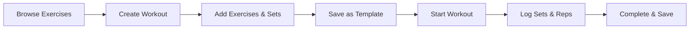
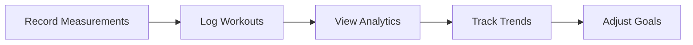

# Jim-app: Advanced Fitness & Workout Tracking Platform

## Overview

Jim-app is a comprehensive full-stack fitness and workout tracking web application designed for fitness enthusiasts, athletes, and anyone looking to maintain a structured fitness routine. The platform combines modern web technologies with an intuitive user experience to provide complete workout management, progress tracking, and social fitness features. Built with scalability and security in mind, Jim-app offers both personal fitness tracking and community-driven workout sharing.

---

## Table of Contents
- [Features](#features)
- [Technologies Used](#technologies-used)
- [System Requirements](#system-requirements)
- [Installation & Setup](#installation--setup)
- [Usage](#usage)
- [Contributing](#contributing)
- [License](#license)
- [Team](#team)

---

## Features

### 🏋️ **Workout Management**
- **Custom Workout Creation:** Build personalized workouts with detailed exercise selection
- **Workout Templates:** Save and reuse workout configurations for consistency
- **Real-time Workout Tracking:** Log sets, reps, weights, and rest times during workouts
- **Workout History:** Complete chronological log of all workout sessions with detailed analytics

### 💪 **Exercise Database**
- **Comprehensive Exercise Library:** 500+ pre-loaded exercises with detailed instructions
- **Visual Exercise Guides:** High-quality images and GIFs for proper form demonstration
- **Exercise Categorization:** Organized by muscle groups, equipment, and difficulty levels
- **Custom Exercise Creation:** Add personalized exercises with custom parameters

### 📊 **Progress Tracking & Analytics**
- **Body Measurements:** Track chest, waist, arms, and weight progression over time
- **Interactive Charts:** Visual progress representation using Recharts library
- **Workout Statistics:** Volume, frequency, and performance metrics analysis
- **Achievement System:** Milestone tracking and goal achievement recognition

### 🗓️ **Smart Scheduling & Planning**
- **Workout Calendar:** Visual calendar with workout scheduling and history
- **Routine Management:** Create structured workout programs with exercise sequences
- **Progress Reminders:** Smart notifications for consistency maintenance

### 👥 **Social & Community Features**
- **User Profiles:** Customizable profiles with fitness stats and achievements
- **Workout Sharing:** Share workouts and routines with the community
- **Follow System:** Connect with other fitness enthusiasts for motivation
- **Public Routine Library:** Access community-created workout routines

### 🔐 **Security & Privacy**
- **JWT Authentication:** Secure login with refresh token rotation
- **Data Privacy Controls:** Granular privacy settings for personal information
- **Secure Password Management:** bcrypt hashing with salt rounds
- **Rate Limiting:** API protection against abuse and unauthorized access

---

## Technologies Used

### **Backend Stack**
- **Runtime:** Node.js (v18+)
- **Framework:** Express.js with TypeScript
- **Database:** MongoDB with Mongoose ODM
- **Authentication:** JSON Web Tokens (JWT) with HTTP-only cookies

### **Frontend Stack**
- **Framework:** React 18 with TypeScript
- **UI Library:** shadcn/ui components with Radix UI primitives
- **Styling:** Tailwind CSS with custom animations
- **Routing:** React Router DOM v7
- **HTTP Client:** Axios with interceptors

### **Development Tools**
- **Version Control:** Git with conventional commits
- **Code Quality:** ESLint, TypeScript strict mode
- **Package Management:** npm with lockfile for reproducible builds
- **Environment Management:** dotenv for configuration

---

## System Requirements

### **Development Environment**
- **Node.js:** v18.0.0 or higher
- **npm:** v8.0.0 or higher
- **MongoDB:** v5.0 or higher (local or cloud)
- **Modern Browser:** Chrome 90+, Firefox 88+, Safari 14+

### **Production Environment**
- **Server:** Linux/Windows server with Node.js support
- **Database:** MongoDB Atlas or self-hosted MongoDB cluster
- **Memory:** Minimum 2GB RAM recommended

---

## Installation & Setup

### **1. Clone the Repository**
```bash
git clone https://github.com/strawberryeleven/Jim-app.git
cd Jim-app
```

### **2. Backend Setup**
```bash
# Navigate to backend directory
cd jim-backend

# Install dependencies
npm install

# Create environment file
cp .env.example .env

# Configure environment variables
```

**Required Environment Variables (.env):**
```env
PORT=5000
MONGODB_URI=mongodb://localhost:27017/jim-app
JWT_SECRET=your-super-secret-jwt-key-change-this-in-production
JWT_REFRESH_SECRET=your-refresh-secret-key
JWT_EXPIRES_IN=7d
NODE_ENV=development
CLIENT_URL=http://localhost:8080
```

```bash
# Start development server
npm run dev
```

### **3. Frontend Setup**
```bash
# Navigate to frontend directory (new terminal)
cd jim-frontend

# Install dependencies
npm install

# Start development server
npm run dev
```

### **4. Database Setup**
- Install MongoDB locally or use MongoDB Atlas
- Create a database named `jim-app`
- The application will automatically create collections on first run

---


## Usage

### **Getting Started**
1. **Register Account:** Create your fitness profile with basic information
2. **Explore Exercises:** Browse the comprehensive exercise library
3. **Create First Workout:** Build a custom workout or choose from templates
4. **Track Progress:** Log workouts and monitor your fitness journey
5. **Set Goals:** Define fitness objectives and track achievements

### **Core Workflows**

#### **Workout Creation & Execution**


#### **Progress Tracking**


### **Advanced Features**
- **Routine Builder:** Create structured weekly workout programs
- **Social Sharing:** Share achievements and workout routines
- **Calendar Integration:** Schedule and track workout consistency
- **Performance Analytics:** Detailed insights into fitness progress

---

## Contributing

We welcome contributions to improve Jim-app! Please follow these guidelines:

### **Development Setup**
1. Fork the repository
2. Create a feature branch (`git checkout -b feature/amazing-feature`)
3. Follow the existing code style and conventions
4. Write tests for new functionality
5. Ensure all tests pass
6. Commit changes (`git commit -m 'Add amazing feature'`)
7. Push to branch (`git push origin feature/amazing-feature`)
8. Open a Pull Request

### **Code Standards**
- Use TypeScript for all new code
- Follow ESLint configuration
- Write meaningful commit messages
- Include tests for new features
- Update documentation as needed

---

## License

This project is licensed under the MIT License - see the [LICENSE](LICENSE) file for details.

**Educational Use:** This project was developed as part of a Web Engineering course and serves as a portfolio demonstration of full-stack development capabilities.

---

---

## Team

- **Muhammad Ibrahim (me aka strawberryeleven)**  
- **Ibrahim Gul**  
- **Ahmad Nadeem**  
- **Raffat Hassan**


**Academic Context:**
- **Institution:** FAST University
- **Course:** Web Engineering (6th Semester)
- **Year:** 2025

---

*Jim-app - Empowering your fitness journey through technology* 💪